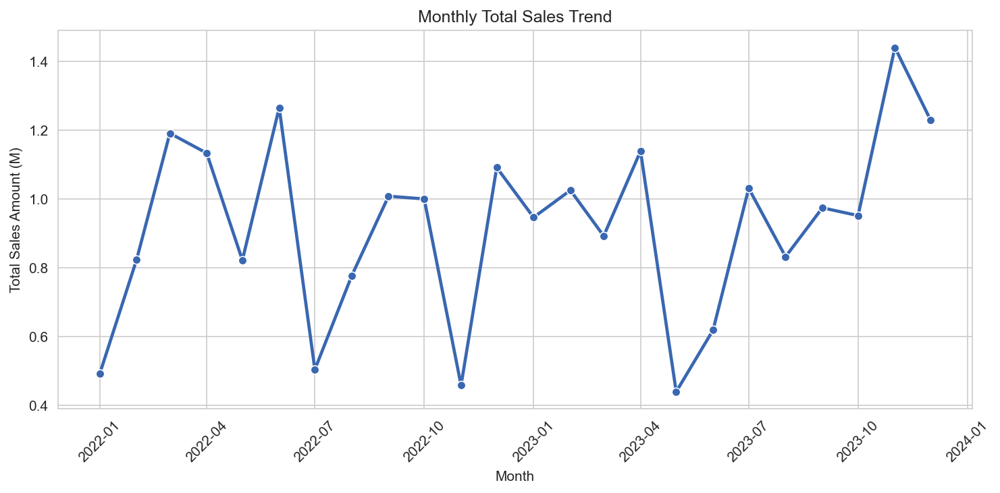
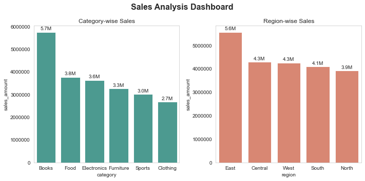
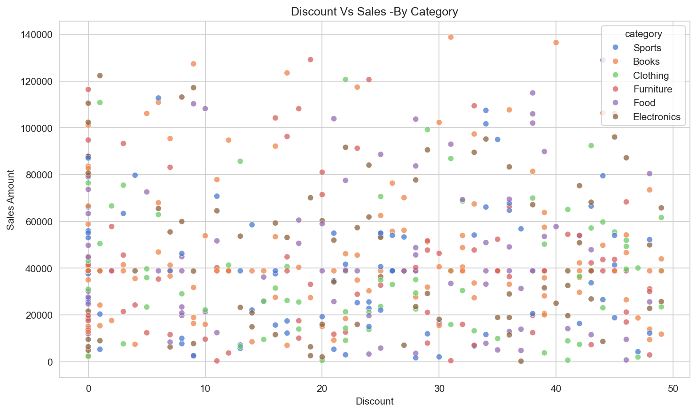
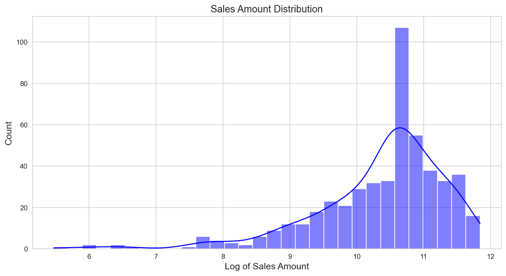
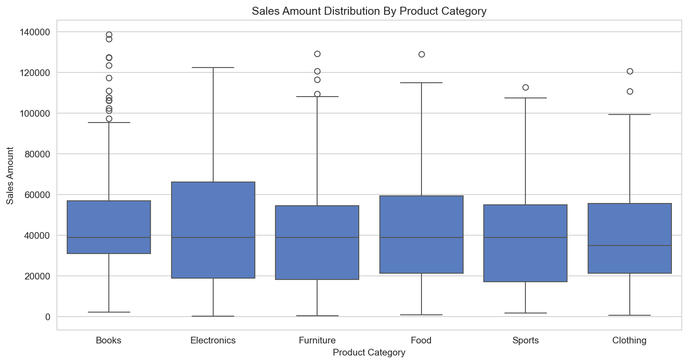

# AI Engineering Portfolio

My structured journey toward becoming an AI Engineer.

## Roadmap
- ✅ P0: Data Analysis — Sales Analysis Project (Python, Pandas, Seaborn)
- ✅ P1: Math for ML — Linear Algebra & Calculus (NumPy implementations + notes)
- ✅ P1: Probability & Statistics 
- ⏳ P2: Classical ML — Sklearn (In progress)
- ⏳ P3: Deep Learning — PyTorch (coming soon)
- ⏳ P4: NLP & LLMs (coming soon)
- ⏳ P5: MLOps & Deployment (coming soon)

## Repository Structure
ai-engineering-portfolio/
├── data/
├── notebook/
├── math_for_ml/
│   ├── linear_algebra_fundamentals.py
│   ├── calculus_fundamentals.py
│   └── calculus_notes.md
└── src/

## P0: Sales Analysis Project

# Sales Analysis Project

## Overview
End-to-end analysis of a retail sales dataset — cleaning raw messy data,
then exploring revenue patterns across time, product category, region,
and discount behavior.

## Goals
- Analyze monthly sales trends over time
- Identify which product category and region generates the most revenue
- Examine the relationship between discount percentage and sales amount
- Understand the distribution of sales amount across categories

## Key Findings
- Books lead category revenue at ~5.7M, indicating strong customer demand
- The East region leads with ~5.6M in total sales
- No clear relationship exists between discount percentage and sales amount
- Electronics shows the highest median sale amount per transaction
- Sales amount was right-skewed — log transformation applied to improve
  distribution visualization

## Visualizations

### Monthly Sales Trend

### Category vs Region Revenue

### Discount vs Sales Amount

### Sales Amount Distribution

### Sales by Category (Box Plot)

## Visualizations Used

| Plot Type | Purpose |
|-----------|---------|
| Line plot | Monthly sales trends over time |
| Bar plot | Category-wise and region-wise revenue comparison |
| Histogram (log transformed) | Distribution of skewed sales data |
| Scatter plot | Relationship between discount and sales amount |
| Box plot | Median sales, spread, and outliers per category |

## How to Run
pip install -r requirements.txt
python src/clean_data.py
jupyter notebook notebook/EDA.ipynb

## Project Structure
Sales_analysis/
├── data/
│   ├── raw/                  # Original messy dataset
│   └── processed/            # Cleaned output
├── notebook/
│   └── EDA.ipynb             # Full exploratory analysis
├── src/
│   ├── __init__.py
│   └── clean_data.py         # Cleaning pipeline
├── .gitignore
├── requirements.txt
└── README.md

## Tech Stack
Python, Pandas, NumPy, Matplotlib, Seaborn
